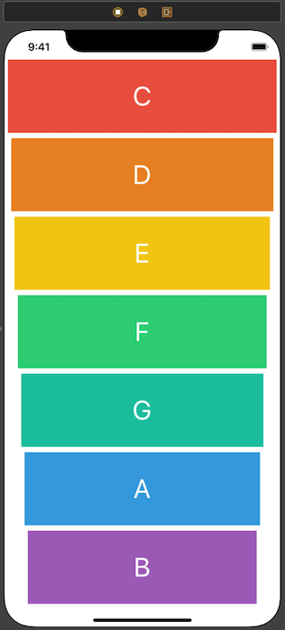
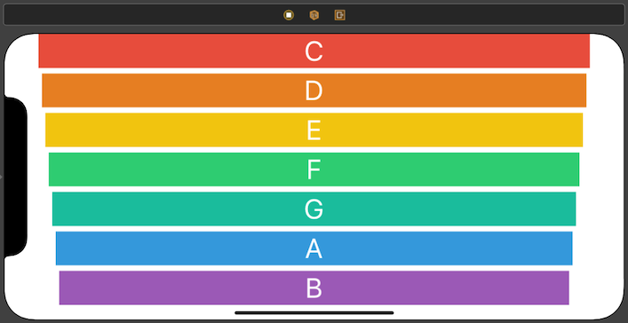

# Xylophone
Xylophone iOS App Native is a colourful XyloPhone app.

# What was worked on this project?
* How to play sound using AVFoundation and AVAudioPlayer.
* The ViewController lifecycle.
* How to use tags in Interface Builder.
* Error handling using try and catch.
* Basic debugging for array index out of range errors.
* Autolayouts

# Funcinality
This App is a simulation of a XyloPhone that is a musical instrument consisting of flat wooden bars of different lengths that are hit with sticks

## Portrait

## Landscape

